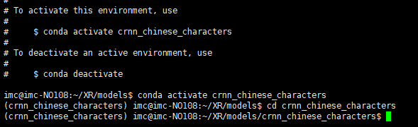
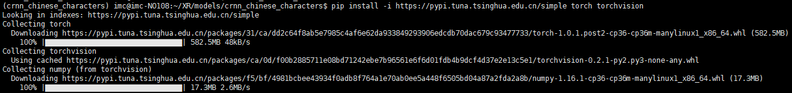
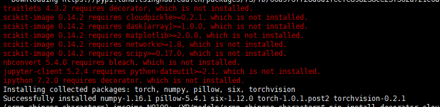
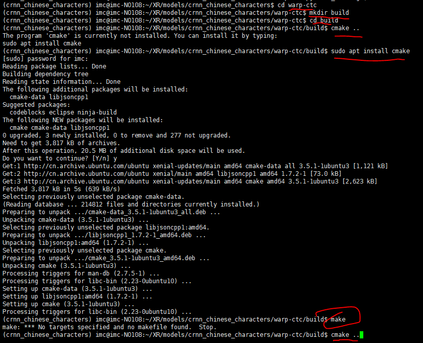
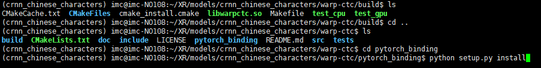
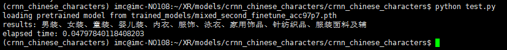
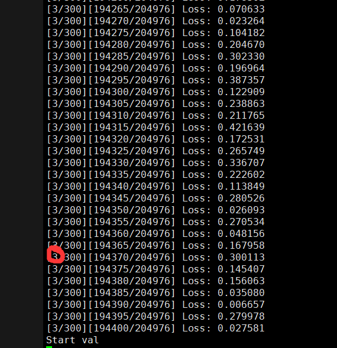

Follow my steps directly

------

- ## install

  this is crnn_chinese_characters: https://github.com/Sierkinhane/crnn_chinese_characters_rec

  Reference  https://www.cnblogs.com/sierkinhane/p/9715582.html

```
conda create -n crnn_chinese_characters python=3.6
```


```
conda activate crnn_chinese_characters

cd crnn_chinese_characters
```



```
pip install -i https://pypi.tuna.tsinghua.edu.cn/simple torch torchvision
```





```
pip install decorator cloudpickle>=0.2.1 dask[array]>=1.0.0 matplotlib>=2.0.0 networkx>=1.8 scipy>=0.17.0 bleach python-dateutil>=2.1 decorator
```

install warp-ctc: https://github.com/SeanNaren/Warp-ctc

```
unzip warp-ctc-pytorch_bindings.zip
cd warp-ctc
mkdir build; cd build
cmake ..
make
```



```
cd pytorch_binding
python setup.py install
```



- ## Test



- ## Training

  making our datasets

   Download 3.6 million Chinese datasets first  <https://pan.baidu.com/s/1ufYbnZAZ1q0AlK7yZ08cvQ>

  The corresponding label of the picture: https://pan.baidu.com/s/1jfAKQVjD-SMJSffOwGhh8A 密码：u7bo

  The next step is to make data in lmdb format. 

  ```
  python tolmdb.py
  ```

  and then....training

  ```
  python3 crnn_main.py --trainroot /lmdb/360label/train/ --valroot /lmdb/360label/val/
  ```

  

