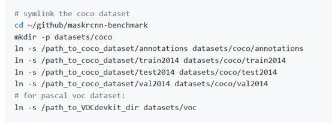
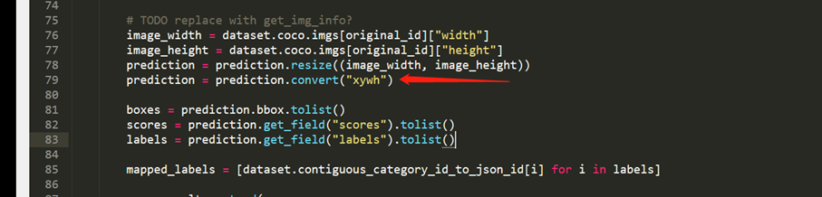

- ## Make our own datasets:

Using a soft connection like Detectron, convert to a coco format datasets



------


- ## Start training:

  ------

  

1. **Adjust training parameters**

In the case of a lot of training goals, that is, when the bbox is a lot, change the big 

```
DETECTIONS_PER_IMG_C.MODEL.ROI_HEADS.DETECTIONS_PER_IMG = 100
```

Turn down NMS_THRESH, mAP will decrease, Similarly, increase to 0.8, mAP will rise a little

```
MODEL.RPN.NMS_THRESH = 0.7
```

The resolution is generally 7 or 14

```
MODEL.ROI_BOX_HEAD.POOLER_RESOLUTION = 14
```

```
MODEL.ROI_HEADS.NMS = 0.5   #Reducing this parameter will lower the mAP. Similarly, increasing this parameter will increase the mAP.
```

Adopt Cavity Convolution

```
MODEL.RESNETS.RES5_DILATION
```

Sampling Rate

```
MODEL.ROI_BOX_HEAD.POOLER_SAMPLING_RATIO = 2  #Increase to 4, mAP is almost unchanged

MODEL.ROI_MASK_HEAD.POOLER_SAMPLING_RATIO = 2
```

Freeze the layer of the pre-training model

```
MODEL.BACKBONE.FREEZE_CONV_BODY_AT = 2
```

------

2.**Online datasets enhancement:**

Reference document

[**maskrcnn-benchmark/maskrcnn_benchmark/data/transforms/build.py**](https://github.com/facebookresearch/maskrcnn-benchmark/blob/61ffdb3803db562c23d883439aee16e599c051e6/maskrcnn_benchmark/data/transforms/build.py#L9)

------

3.**Training order:**

Using distributed training, you can make better use of multiple gpus

```
export NGPUS=2
python -m torch.distributed.launch --nproc_per_node=$NGPUS --master_port=6002 /tools/train_net.py --config-file config/file.yaml
```

```
CUDA_VISIBLE_DEVICES=2,3 python -m
torch.distributed.launch --master_port=6002 --nproc_per_node=$NGPUS tools/train.py configs/faster_rcnn_r101_fpn_1x.py --gpus 2
```

------

- ## Test

1. **Adjust test parameters**

First you need to specify the WEIGHT parameter. 

a) The test scale is adjusted and doubled. The memory is almost only increased by 1.2G, and the test time is almost doubled. Because **the test picture is too large, the map drops sharply**.

```
_C.INPUT.MIN_SIZE_TEST = 800---->1333

_C.INPUT.MAX_SIZE_TEST = 1333--->2666
```

b) parameters that are valid only at the time of testing

```
MODEL.ROI_HEADS.NMS = 0.5 
```

2.**Test naming**

a) Single GPU test

b) Multi-gpu distributed test

```
export NGPUS=2
python -m torch.distributed.launch --nproc_per_node=$NGPUS /tools/test_net.py --config-file config/file.yaml
```

A file will be generated after the test is completed:

Test output: a **bbox.json** file is automatically generated. This file is generated in the [**maskrcnn-benchmark/maskrcnn_benchmark/data/datasets/evaluation/coco/coco_eval.py**](https://github.com/facebookresearch/maskrcnn-benchmark/blob/f25c6cff92d32d92abe8965d68401004e90c8bee/maskrcnn_benchmark/data/datasets/evaluation/coco/coco_eval.py#L277-L283) script. The bbox output format is xywh, which can be modified to xyxy.

